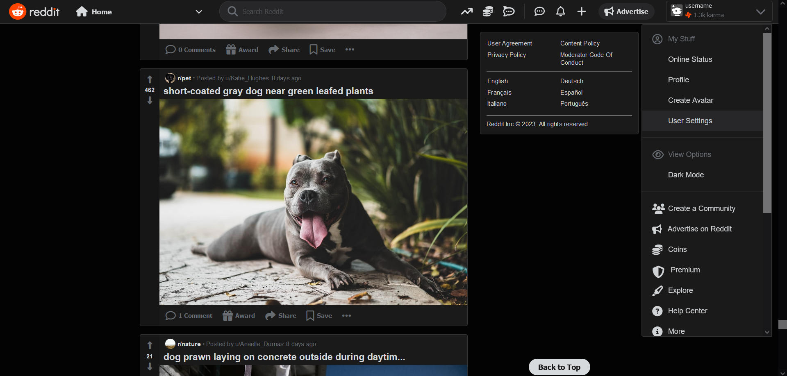

# Reddit Clone in Vanilla JS

This practice project aims to recreate the home page of Reddit as of march 2023 in pure html, css and javascript. 

Check out my [other repository](https://github.com/teooko/Reddit-Clone-React) of the same page made in **React**. 

# Technical Details

The page uses a social media mock api called [dummyapi.io](https://dummyapi.io/) and [Lorem Picsum](https://picsum.photos/) for subbreddit pictures. 

There are 5 posts added to the feed each time the user scrolls to the bottom of the page, thus making it an 'infinite scroller' page. 

Each api request is used to set the subreddit name and picture, username and number of upvotes, there is an additional request for the total number of comments.

# Setting up
Instructions on starting the website:

1. Create a `config.js` file in the repository's folder
2. Add the dummyapi key in this format: `API_KEY = 'your key';`
3. Open the `index.html` file.
